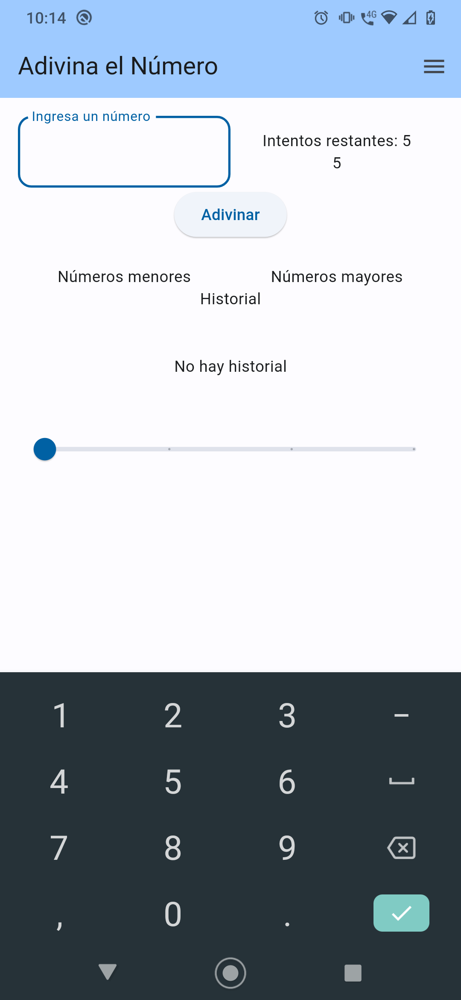
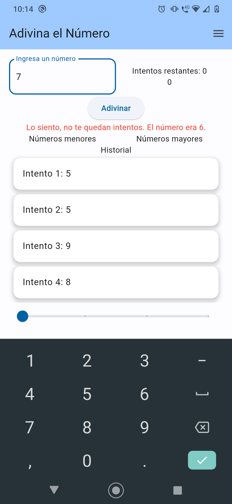

# game_guess_number

El objetivo de este juego para móvil es que el usuario adivine un numero en el cual habra numero de intentos y niveles de dificultad.

# Requerimientos

- Flutter SDK versión 3.16.5
- Dart SDK versión 3.2.3
- Plugins en Android Studio: Dart and Flutter.
- Paquetes: 
- Android Studio Giraffe 2022.3.1 Patch 3

# Flujo de la aplicación móvil

-Vistas dela aplicación móvil
    - 1.- Vista Home Aplicación móvil
      
    - 2.- Nivel Fácil
      
    - 3.- Teclado number
      
    - 4.- Validación Incorrecta Lo siento...
      
    - 5.- Nivel Medio
      
    - 6.- Validación Correcta Felicidades
      
    - 7.- Nivel Avanzado
      
    - 8.- Nivel Extremo
      
    - 9.- Menu de la aplicación
      
